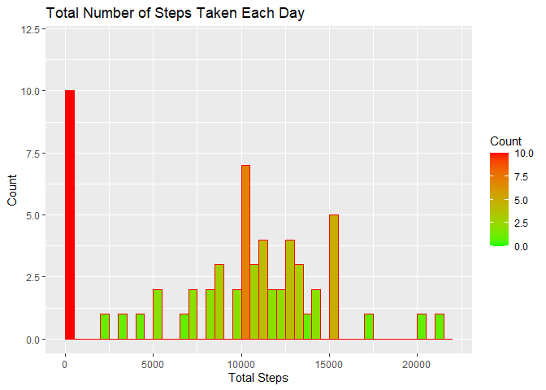
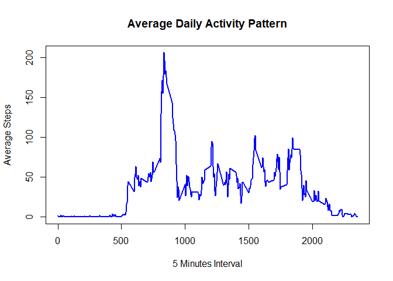
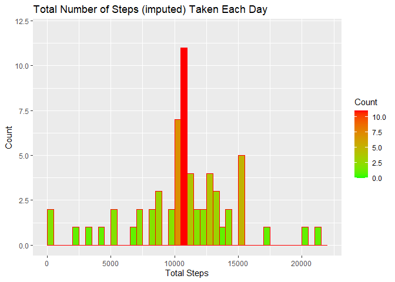
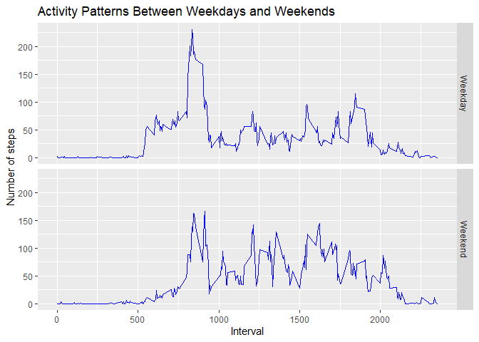

## Loading and preprocessing the data


```r
options(scipen=999)
library(ggplot2)
library(dplyr)
library(tidyr)
```


```r
# Download zip file with data and unzip data in data folder to extract datasets
fileurl<-"https://d396qusza40orc.cloudfront.net/repdata%2Fdata%2Factivity.zip"
if (!file.exists("./data")) {dir.create("./data")}
download.file(fileurl, destfile = "./data/repdata_data_activity.zip")
# Unzip data
unzip(zipfile = "./data/repdata_data_activity.zip", exdir = paste(getwd(),"/data", sep=""))
activity<-read.csv(file="./data/activity.csv", header = TRUE, sep = ",")
# Convert character date to data format
activity$date<-as.Date(activity$date)
```

## What is mean total number of steps taken per day?

```r
# Calculate the total number of steps taken per day
totalSteps<-with(activity, tapply(steps, date, sum, na.rm=TRUE))

totalSteps<-data.frame(date=names(totalSteps), total=totalSteps)
```

### Histogram of the total number of steps taken each day


```r
ggplot(totalSteps, aes(total)) +
    geom_histogram(breaks=seq(0, 22000, by=500), col="red", aes(fill=..count..)) +
    scale_fill_gradient("Count", low="green", high="red") +
    labs(title="Total Number of Steps Taken Each Day", x="Total Steps", y="Count")+
    ylim(0,12)
```

<!-- -->

### Mean and median of the total number of steps taken per day


```r
totalSteps %>% summarise(mean=mean(total), median=median(total))
```

```
##      mean median
## 1 9354.23  10395
```

## What is the average daily activity pattern?

```r
# calculate average steps for each interval across all days
averageSteps<-with(activity, tapply(steps, interval, mean, na.rm=TRUE))

averageSteps<-data.frame(interval=as.numeric(names(averageSteps)), mean=averageSteps)
```

### Time series plot of the 5-minute interval (x-axis) and the average number of steps taken, averaged across all days (y-axis)


```r
with(averageSteps, plot(interval, mean, type="l", lwd=2, col="blue", main="Average Daily Activity Pattern", xlab="5 Minutes Interval", ylab="Average Steps"))
```

<!-- -->

### Which 5-minute interval, on average across all the days in the dataset, contains the maximum number of steps?


```r
averageSteps %>% filter(mean==max(averageSteps$mean))
```

```
##     interval     mean
## 835      835 206.1698
```

## Imputing missing values

### Total number of missing values in the dataset


```r
# Calculate and report the total number of missing values in the dataset (i.e. the total number of rows with NAs)
sum(is.na(activity$steps))
```

```
## [1] 2304
```

### Impute missing values with mean for that particular 5 minute interval across all days.


```r
# Create new dataset with original and imputed values of missing steps
# Join activity dataset with averageSteps that contains mean for that particular 5 minute
activity_imputed<-inner_join(activity, averageSteps, by = "interval")

# Replace missing values of step with interval mean across all days for that particula interval
activity_imputed<-activity_imputed %>% mutate(steps_imputed=ifelse(is.na(steps), mean, steps))

# Calculate the total number of steps taken per day
totalImputedSteps<-with(activity_imputed, tapply(steps_imputed, date, sum, na.rm=TRUE))

totalImputedSteps<-data.frame(date=names(totalImputedSteps), total_imputed=totalImputedSteps)
```

### Histogram of the total number of steps (imputed) taken each day


```r
ggplot(totalImputedSteps, aes(total_imputed)) +
    geom_histogram(breaks=seq(0, 22000, by=500), col="red", aes(fill=..count..)) +
    scale_fill_gradient("Count", low="green", high="red") +
    labs(title="Total Number of Steps (imputed) Taken Each Day", x="Total Steps", y="Count")+
    ylim(0,12)
```

<!-- -->

### Mean and median of the total number of steps (imputed) taken per day


```r
totalImputedSteps %>% summarise(mean=mean(total_imputed), median=median(total_imputed))
```

```
##       mean   median
## 1 10766.19 10766.19
```

### Do these values differ from the estimates from the first part of the assignment?
+ Mean (10766.19) and median (10766.19) of imputed steps increased from the estimated mean (9354.23) and median (10395) from the first part of the assignment

### What is the impact of imputing missing data on the estimates of the total daily number of steps?
+ There are now more number of days with total steps >10,000 due to imputation of missing steps


## Are there differences in activity patterns between weekdays and weekends?

```r
# Create a new factor variable in the dataset with two levels – “weekday” and “weekend” indicating whether a
# given date is a weekday or weekend day.
activity_imputed<-activity_imputed %>% mutate(days=ifelse(weekdays(date) %in% c("Saturday","Sunday"), "Weekend", "Weekday"))
activity_imputed$days<-as.factor(activity_imputed$days)
```


```r
# Make a panel plot containing a time series plot (i.e. type = "l") of the 5-minute interval (x-axis) and the 
# average number of steps taken, averaged across all weekday days or weekend days (y-axis)

avgImputedSteps = aggregate(activity_imputed$steps_imputed,
                by = list(activity_imputed$interval, activity_imputed$days),
                FUN = mean)

names(avgImputedSteps)<-c("interval","days", "mean")

qplot(interval, mean, data = avgImputedSteps, geom="line", colour = I("blue"), facets=days~., main = "Activity Patterns Between Weekdays and Weekends", xlab = "Interval", ylab = "Number of steps")
```

<!-- -->

  
